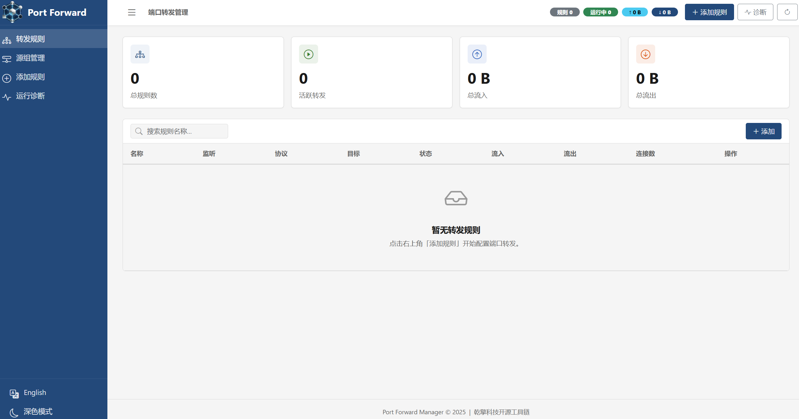
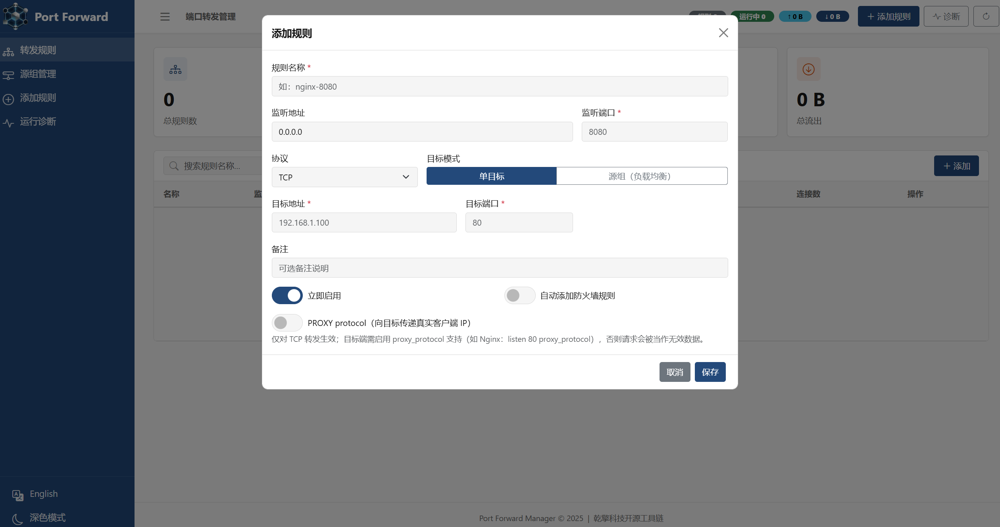
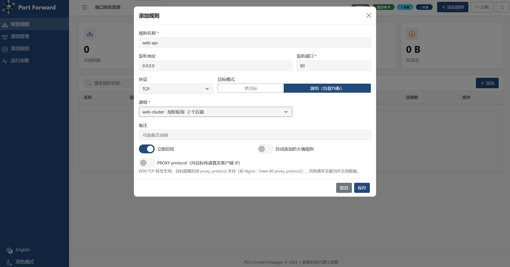
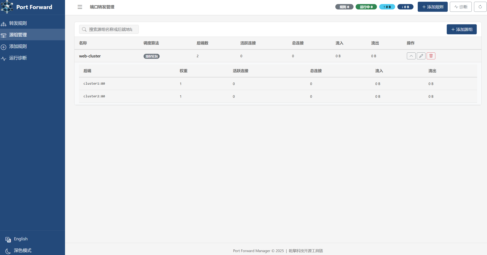
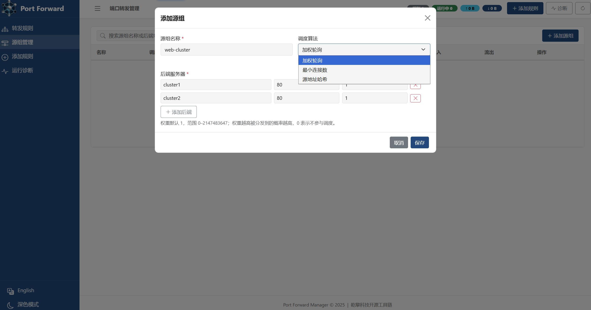

# Go Port Forward

高性能跨平台 TCP/UDP/Both 端口转发工具，内置 Web 管理界面，支持源组负载均衡（加权轮询 / 最小连接数 / 源地址哈希）。

A high-performance cross-platform TCP/UDP port forwarder with a built-in Web UI and upstream-group load balancing (weighted round robin / least connections / source-IP hash).

## 源码地址 | Source Code

| 平台           | 地址                                           |
|--------------|----------------------------------------------|
| 🌐 Github 主站 | https://github.com/shibingli/go-port-forward |
| 🪞 Gitee 镜像站 | https://gitee.com/shibingli/go-port-forward  |

## 下载 | Download

[点击下载](https://github.com/shibingli/go-port-forward/releases)

## 📸 截图 | Screenshots

### 首页 | Dashboard


### 转发列表 | Rule List


### 添加转发 | Add Rule


### 规则引用源组 | Rule with Upstream Group


### 源组管理 | Upstream Groups


### 添加源组 | Add Upstream Group


### WSL2 端口导入 | WSL2 Import


### 诊断工具 | Diagnostics


## ✨ 功能特性 | Features

- **TCP / UDP / Both** 端口转发，支持同时转发双协议
  Port forwarding with dual-protocol support
- **源组负载均衡** — 源组（upstream group）聚合多个后端，支持加权轮询 / 最小连接数 / 源地址哈希三种调度算法；规则可引用源组实现多后端流量分发，实时查看每后端连接与流量
  Upstream-group load balancing — group backends and schedule with weighted round robin / least connections / source-IP hash; rules reference a group for multi-backend distribution with live per-backend stats
- **Web 管理界面** — 基于 Alpine.js + Bootstrap 5 的现代化单页应用
  Built-in Web UI — a modern SPA built with Alpine.js + Bootstrap 5
- **运行诊断面板** — 实时查看 runtime / goroutine pool / rule health / 热点规则，并支持一键定位异常规则
  Diagnostics panel — real-time runtime / goroutine pool / rule health / hot rules with one-click navigation to problematic rules
- **WSL2 端口导入** — 自动发现 WSL2 发行版监听端口并一键导入转发规则
  WSL2 port import — auto-discover listening ports in WSL2 distros and import forwarding rules in one click
- **跨平台防火墙管理** — Windows (netsh)、Linux (iptables)、macOS (pfctl) 自动添加/删除防火墙规则
  Cross-platform firewall management — automatically add/remove firewall rules on Windows (netsh), Linux (iptables), macOS (pfctl)
- **系统服务支持** — 可注册为 Windows Service / Linux systemd / macOS launchd 后台服务
  System service support — register as Windows Service / Linux systemd / macOS launchd
- **高性能并发** — 基于 [ants](https://github.com/panjf2000/ants) 协程池，支持高并发连接
  High-performance concurrency — powered by [ants](https://github.com/panjf2000/ants) goroutine pool
- **嵌入式存储** — 使用 [bbolt](https://go.etcd.io/bbolt) 嵌入式 KV 数据库，零依赖部署
  Embedded storage — [bbolt](https://go.etcd.io/bbolt) KV database, zero-dependency deployment
- **自动 GC 管理** — 内存阈值触发 + 定时 GC，多种回收策略可选
  Automatic GC management — memory-threshold-triggered + scheduled GC with multiple strategies
- **YAML 配置** — 首次运行自动生成默认配置文件
  YAML configuration — auto-generated default config on first run
- **全局 IP 访问控制** — 基于 CIDR 名单（白名单/黑名单）在 Accept 阶段拦截连接与 UDP 报文，兼容 chnroute 等公开名单
  Global IP access control — CIDR-list-based (allowlist/blocklist) filtering of connections and UDP datagrams at Accept time, compatible with public lists such as chnroute
- **PROXY protocol v1 透传** — TCP 转发时向目标注入 PROXY protocol v1 头部，让后端拿到真实客户端地址（Nginx / HAProxy 等可直接识别）
  PROXY protocol v1 passthrough — injects a PROXY protocol v1 header into TCP target connections so backends (Nginx / HAProxy, etc.) can see the real client address

## 🎯 痛点分析 | Pain Points

| 痛点 Pain Point | 传统方案 Traditional Approach | Go Port Forward 解决方式 Solution |
|----------------|---------------------------|-------------------------------|
| **WSL2 端口不可达** WSL2 ports unreachable | 每次重启后手动执行 `netsh interface portproxy` 命令，IP 地址经常变化 Manually run `netsh interface portproxy` after every reboot; IP changes frequently | 自动发现 WSL2 发行版 IP 与监听端口，一键导入转发规则，重启后自动恢复 Auto-discover WSL2 distro IPs & listening ports, one-click import, auto-restore on restart |
| **单后端单点故障** Single-backend SPOF | 端口转发工具只能指向一个固定地址，后端宕机则服务整体中断，扩容需重新配置规则 Port forwarders point to one fixed address; a backend outage interrupts the whole service and scaling requires rule reconfiguration | 源组聚合多后端按权重分发流量，摘除节点只需将权重置 0，Web UI 实时展示每后端连接与流量 Upstream groups distribute traffic across weighted backends; drain a node by setting its weight to 0, with live per-backend stats in the Web UI |
| **防火墙规则繁琐** Tedious firewall rules | 需要在 Windows/Linux/macOS 上分别记忆 netsh / iptables / pfctl 命令语法 Must memorize netsh / iptables / pfctl syntax for each OS | 跨平台统一 API，创建转发规则时自动添加防火墙放行，删除时自动清理 Unified cross-platform API; auto-add firewall allow on create, auto-clean on delete |
| **缺少可视化管理** No visual management | SSH 隧道、socat、rinetd 等工具均为命令行操作，难以一目了然查看所有规则状态 SSH tunnels, socat, rinetd are all CLI-only, hard to overview all rules | 内置 Web UI，实时查看规则状态、连接数与流量统计，支持增删改查与一键启停 Built-in Web UI with real-time rule status, connection count & traffic stats, full CRUD & one-click toggle |
| **进程退出规则丢失** Rules lost on exit | iptables 转发规则或 socat 进程重启后消失，需手写 systemd 脚本保持持久化 iptables rules or socat processes vanish on restart; requires manual systemd scripts | 基于 bbolt 嵌入式数据库持久化所有规则，服务启动时自动恢复所有活跃转发 All rules persisted in bbolt; active forwarders auto-restored on startup |
| **高并发性能不足** Poor concurrency | socat 每连接 fork 进程，rinetd 单线程阻塞模型，面对大量连接时资源消耗大 socat forks per connection, rinetd is single-threaded blocking | 基于 Go 协程 + ants 协程池，高并发连接下内存占用可控 Go goroutines + ants pool, controlled memory under high concurrency |
| **部署依赖复杂** Complex deployment | 需要安装 Python/Node.js 运行时或依赖外部数据库 Requires Python/Node.js runtime or external database | 单个二进制文件零依赖部署，内嵌 Web 资源与 KV 存储，开箱即用 Single binary, zero-dependency, embedded Web assets & KV store |
| **跨平台不统一** Inconsistent cross-platform | 不同工具在 Windows/Linux/macOS 上配置方式完全不同 Different tools have completely different configs on each OS | 同一份代码与配置，三大平台行为一致，支持注册为系统服务 Same code & config across all three platforms, supports system service registration |

## 🏗️ 应用场景 | Use Cases

### 1. WSL2 开发环境端口暴露 | WSL2 Dev Environment Port Exposure

在 Windows 上使用 WSL2 进行开发时，WSL2 内部的服务（如 Nginx、MySQL、Redis）默认无法被局域网其他设备访问。Go Port Forward 可自动发现 WSL2 中的监听端口并创建转发规则，让同事的手机或其他电脑直接访问你的开发环境。

When developing with WSL2 on Windows, services inside WSL2 (e.g., Nginx, MySQL, Redis) are not accessible from the LAN by default. Go Port Forward auto-discovers listening ports in WSL2 and creates forwarding rules so that colleagues' phones or other computers can directly access your dev environment.

### 2. 内网服务统一转发网关 | Intranet Unified Forwarding Gateway

在企业内网中，多台服务器上运行着不同端口的服务。通过在一台网关机器上部署 Go Port Forward，可将所有服务端口集中转发和管理，Web UI 提供清晰的规则总览与流量监控。

In an enterprise intranet, multiple servers run services on different ports. By deploying Go Port Forward on a gateway machine, you can centrally forward and manage all service ports, with the Web UI providing a clear rule overview and traffic monitoring.

### 3. 容器 / 虚拟机端口映射 | Container / VM Port Mapping

Docker 容器、VMware/VirtualBox 虚拟机的网络模式（NAT、Host-Only）经常导致端口不可达。使用 Go Port Forward 在宿主机上建立转发规则，无需修改容器或虚拟机网络配置即可对外提供服务。

Docker containers and VMware/VirtualBox VMs with NAT or Host-Only networking often have unreachable ports. Use Go Port Forward on the host to set up forwarding rules without modifying container or VM network configurations.

### 4. 远程调试与测试 | Remote Debugging & Testing

后端开发人员需要将本地运行的 API 服务暴露给前端/测试同事访问。通过 Go Port Forward 将 `127.0.0.1:3000` 转发到 `0.0.0.0:3000`，配合自动防火墙放行，一键完成端口对外开放。

Backend developers need to expose locally running API services to frontend/QA colleagues. Use Go Port Forward to forward `127.0.0.1:3000` to `0.0.0.0:3000` with automatic firewall allow rules — one click to open the port externally.

### 5. UDP 游戏/音视频服务转发 | UDP Game / Audio-Video Forwarding

游戏服务器、VoIP、视频流等场景需要 UDP 转发能力。Go Port Forward 同时支持 TCP 和 UDP 协议转发，并可选择 `both` 模式双协议同时转发，无需部署两套工具。

Game servers, VoIP, and video streaming scenarios require UDP forwarding. Go Port Forward supports both TCP and UDP forwarding, with a `both` mode for dual-protocol forwarding — no need to deploy two separate tools.

### 6. 轻量级生产环境端口网关 | Lightweight Production Port Gateway

在不需要 Nginx/HAProxy 完整反向代理功能的场景下（如纯 TCP 数据库代理、IoT 设备通信网关），Go Port Forward 可作为轻量级的四层端口网关，单二进制部署、资源占用极低。

When full Nginx/HAProxy reverse proxy features are not needed (e.g., pure TCP database proxy, IoT device communication gateway), Go Port Forward serves as a lightweight Layer-4 port gateway with single-binary deployment and minimal resource usage.

### 7. 多后端负载均衡 | Multi-Backend Load Balancing

将同一服务的多个实例组成源组（如 3 台 Nginx、2 台 MySQL），转发规则引用源组即可按加权轮询、最小连接数或源地址哈希分发流量，无需部署完整反向代理即可获得 L4 负载均衡能力；Web UI 实时展示每个后端的连接数与流量，临时下线节点只需将其权重置 0。

Group multiple instances of the same service into an upstream group (e.g. 3 Nginx or 2 MySQL nodes) and reference it from a rule to distribute traffic with weighted round robin, least connections, or source-IP hash — L4 load balancing without deploying a full reverse proxy. The Web UI shows live per-backend connection & traffic stats, and taking a node offline temporarily is as simple as setting its weight to 0.

## 📦 项目结构 | Project Structure

```
go-port-forward/
├── main.go                  # 程序入口 | Entry point
├── config.yaml              # 配置文件 | Configuration
├── internal/
│   ├── config/              # 配置加载 (Viper) | Config loading
│   ├── firewall/            # 跨平台防火墙管理 | Cross-platform firewall
│   │   ├── firewall.go      # 接口定义 | Interface
│   │   ├── firewall_windows.go
│   │   ├── firewall_linux.go
│   │   └── firewall_darwin.go
│   ├── forward/             # 转发核心 | Forwarding core
│   │   ├── manager.go       # 规则生命周期管理 | Rule lifecycle
│   │   ├── balancer.go      # 负载均衡调度器（WRR / WLC / 一致性哈希） | Load-balancing scheduler (WRR / WLC / consistent hash)
│   │   ├── ipfilter.go      # IP 过滤接线与限流日志 | IP filter wiring & rate-limited logging
│   │   ├── tcp.go           # TCP 转发器 | TCP forwarder
│   │   └── udp.go           # UDP 转发器 | UDP forwarder
│   ├── logger/              # 日志初始化 | Logger init
│   ├── models/              # 数据模型 | Data models
│   ├── storage/             # bbolt 持久化 | bbolt persistence
│   ├── svc/                 # 系统服务封装 | System service wrapper
│   └── web/                 # Web 服务 + 嵌入式静态资源 | Web server + embedded static
│       ├── server.go
│       ├── handlers.go
│       ├── handlers_wsl.go
│       └── static/          # 前端资源 (Alpine.js, Bootstrap, HTMX)
├── pkg/
│   ├── gc/                  # GC 管理服务 | GC management
│   ├── ipfilter/            # CIDR 名单 IP 过滤 | CIDR-list IP filtering
│   ├── pool/                # 协程池封装 (ants) | Goroutine pool
│   ├── proxyproto/          # PROXY protocol v1 头部生成 | PROXY protocol v1 header generation
│   ├── retry/               # 重试机制 | Retry utilities
│   ├── logger/              # 全局日志桥接 | Global logger bridge
│   ├── serializer/          # JSON 序列化 (sonic/jsoniter) | JSON serialization
│   └── os/                  # OS 工具 (WSL 发现等) | OS utilities
└── data/
    └── rules.db             # bbolt 数据库文件 | Database file
```

## 🚀 快速开始 | Quick Start

### 编译 | Build

项目提供了跨平台构建脚本，支持一键编译所有平台（Windows / Linux / macOS，amd64 / arm64 / arm）并自动打包。

Cross-platform build scripts are provided for one-click compilation of all platforms (Windows / Linux / macOS, amd64 / arm64 / arm) with automatic packaging.

```bash
# Linux / macOS
bash build.sh              # 构建所有平台 | Build all platforms
bash build.sh windows      # 仅构建 Windows | Build Windows only
bash build.sh linux        # 仅构建 Linux | Build Linux only
bash build.sh darwin       # 仅构建 macOS | Build macOS only
```

```powershell
# Windows (PowerShell)
.\build.ps1                # 构建所有平台 | Build all platforms
.\build.ps1 -Target windows   # 仅构建 Windows | Build Windows only
.\build.ps1 -Target linux     # 仅构建 Linux | Build Linux only
.\build.ps1 -Target darwin    # 仅构建 macOS | Build macOS only
```

构建产物输出到 `dist/` 目录，包含可执行文件、配置示例和 SHA256 校验文件。

Build artifacts are output to the `dist/` directory, including executables, config samples, and SHA256 checksum files.

> 也可通过环境变量指定版本号 | You can also specify the version via environment variable: `VERSION=v1.0.0 bash build.sh`

### CI/CD 自动发布 | Automated Release

项目集成了 GitHub Actions，推送符合格式的 tag 后会自动触发全平台构建并创建 GitHub Release。

The project integrates GitHub Actions. Pushing a properly formatted tag automatically triggers cross-platform builds and creates a GitHub Release.

```bash
# 正式版本发布 | Stable release
git tag v1.0.0
git push origin v1.0.0

# 预发布版本（带后缀自动标记为 Pre-release）| Pre-release (suffix auto-marked as Pre-release)
git tag v1.0.0-beta.1
git push origin v1.0.0-beta.1
```

**触发规则 | Trigger rule:** tag 格式为 `v{major}.{minor}.{patch}` 或 `v{major}.{minor}.{patch}-{suffix}`。

**自动完成 | Automated steps:** 7 个平台产物编译 → 打包归档 → 生成 SHA256 校验 → 创建 Release 并上传。
7 platform artifacts compiled → archived → SHA256 checksums generated → Release created & uploaded.

### 运行 | Run

```bash
# 前台运行 | Foreground
./go-port-forward

# 指定配置文件 | With custom config
./go-port-forward -config /path/to/config.yaml
```

启动后访问 `http://127.0.0.1:8080` 打开 Web 管理界面。

After startup, visit `http://127.0.0.1:8080` to open the Web management UI.

### 系统服务 | System Service

```bash
# 安装为系统服务 | Install as system service
./go-port-forward -service install

# 以服务方式运行 | Run as service
./go-port-forward -service run

# 卸载服务 | Uninstall service
./go-port-forward -service uninstall
```

## ⚙️ 配置 | Configuration

首次运行时会在可执行文件同目录自动生成 `config.yaml`。

A default `config.yaml` is auto-generated in the same directory as the executable on first run.

```yaml
web:
  host: 127.0.0.1          # Web UI 监听地址 | Listen address
  port: 8080                # Web UI 端口 | Port
  # username: admin         # Basic Auth 用户名 (留空禁用) | Username (leave empty to disable)
  # password: secret        # Basic Auth 密码 | Password

storage:
  path: data/rules.db       # 数据库路径 | Database path

log:
  level: info               # 日志级别 | Log level: debug | info | warn | error
  path: logs/app.log        # 日志文件路径 | Log file path
  max_size_mb: 50           # 单文件最大 MB | Max size per file (MB)
  max_backups: 5            # 保留备份数 | Max backup count
  max_age_days: 30          # 保留天数 | Max retention days
  compress: true            # 压缩归档 | Compress archived logs

forward:
  buffer_size: 32768        # I/O 缓冲区大小 (bytes) | I/O buffer size
  dial_timeout: 10          # 出站连接超时 (秒) | Outbound dial timeout (seconds)
  udp_timeout: 30           # UDP 会话空闲超时 (秒) | UDP session idle timeout (seconds)
  pool_size: 0              # 协程池大小 (0 = 自动) | Goroutine pool size (0 = auto)

ipfilter:
  enabled: false            # 启用全局 IP 过滤 | Enable global IP filtering
  mode: allowlist           # 过滤模式 | Mode: allowlist（仅放行名单内）/ blocklist（仅拦截名单内）
  cidrs_file: ""            # 外部名单文件（每行一个 CIDR，支持 # 注释）| External list file (one CIDR per line, '#' comments)
  cidrs: []                 # 内联 CIDR 条目 | Inline CIDR entries
  allow_private: true       # 始终放行私网/环回/链路本地地址 | Always allow private/loopback/link-local addresses
  log_blocked: sample       # 拦截日志 | Block logging: sample（限流聚合）/ off

gc:
  enabled: true
  interval_seconds: 300     # GC 间隔 (秒) | GC interval (seconds)
  strategy: standard        # GC 策略 | GC strategy: standard | aggressive | conservative
  memory_threshold_mb: 100  # 内存阈值 (MB) | Memory threshold (MB)
  enable_monitoring: true
```

### 全局 IP 过滤 | Global IP Filtering

启用 `ipfilter` 后，所有转发规则在 **Accept / 读取报文阶段** 即对源地址过滤：被拒绝的 TCP 连接立即关闭（对端快速失败），被拦截的 UDP 报文直接丢弃——两者都不会创建会话、不会连接上游，对后端完全无感。

When `ipfilter` is enabled, every rule filters source addresses at **Accept / datagram-read time**: rejected TCP connections are closed immediately (fast failure for the peer) and blocked UDP datagrams are dropped — neither creates sessions nor upstream connections, keeping backends completely unaffected.

- **典型用法 | Typical use**：`mode: allowlist` + 国内 CIDR 名单（如 chnroute），实现"仅允许国内 IP 访问" | `mode: allowlist` with a CN CIDR list (e.g. chnroute) for "China-only" access
- **名单加载 | List loading**：`cidrs_file` 与 `cidrs` 可叠加使用；任一条目无效都会拒绝启动，避免截断的名单静默生效 | both may be combined; any invalid entry aborts startup so a truncated list never silently takes effect
- **安全默认值 | Safe defaults**：`allow_private: true` 始终放行 RFC1918/环回/链路本地地址，防止误杀内网健康检查与管理流量 | always allows RFC1918/loopback/link-local addresses so internal health checks and management traffic are not blocked
- **生效方式 | Reload**：名单在启动时加载，修改后需重启进程生效 | the list is loaded at startup; changes require a restart
- **可观测性 | Observability**：每条规则的 `blocked_conns` 字段统计拦截数（REST API 可见），`log_blocked: sample` 按分钟聚合输出拦截日志，避免扫描流量刷爆日志 | per-rule `blocked_conns` counter (visible via REST API); `sample` emits one aggregated log line per minute so scan traffic cannot flood the log

### PROXY protocol v1 透传 | PROXY protocol v1 Passthrough

在规则上启用 `proxy_protocol` 后，TCP 转发会在上游连接建立后、转发数据前，先向目标写入一条 PROXY protocol v1 头部（`PROXY TCP4/TCP6 <客户端地址> <转发器地址> <客户端端口> <转发器端口>`，HAProxy 规范），把真实客户端地址透传给后端——解决 L4 转发后后端只能看到转发器内网地址的问题（如 Docker bridge 场景下容器内 Nginx 的 `$remote_addr` 拿不到真实客户端 IP）。

With `proxy_protocol` enabled on a rule, the TCP forwarder writes a PROXY protocol v1 header (`PROXY TCP4/TCP6 <client-addr> <forwarder-addr> <client-port> <forwarder-port>`, per the HAProxy spec) to the target connection right after the upstream connection is established and before any payload, passing the real client address through — solving the problem that L4 forwarding makes backends see only the forwarder's internal address (e.g. Nginx inside a Docker container cannot see the real client IP via `$remote_addr`).

- **启用方式 | Enable**：规则级开关，默认关闭，存量规则行为不变；Web UI 规则表单勾选「PROXY protocol」，或 REST API 创建/更新规则时携带 `proxy_protocol: true`；修改后自动重启对应转发器生效 | per-rule toggle, off by default with existing rules unaffected; tick "PROXY protocol" in the Web UI rule form, or send `proxy_protocol: true` via the REST API; the forwarder restarts automatically to apply changes
- **仅限 TCP | TCP only**：只对 TCP 转发生效（`both` 规则仅 TCP 侧注入）；纯 UDP 规则开启时，创建/更新请求返回 400 直接拒绝 | TCP forwarding only (the TCP side of `both` rules); enabling it on a UDP-only rule is rejected with 400 at create/update
- **目标端要求 | Target requirement**：目标端必须支持 PROXY protocol（如 Nginx `listen 80 proxy_protocol` + `set_real_ip_from`、HAProxy `bind ... accept-proxy`），否则头部会被当作无效数据 | the target must support PROXY protocol (e.g. Nginx `listen 80 proxy_protocol` + `set_real_ip_from`, HAProxy `bind ... accept-proxy`); otherwise the header is treated as invalid data
- **协议细节 | Protocol details**：IPv4 / IPv6 分别输出 `PROXY TCP4` / `PROXY TCP6`，IPv4-mapped IPv6 按点分形式输出；地址族无法确定或不一致时输出 `PROXY UNKNOWN`（合规接收端会忽略该行并回退到实际连接地址） | emits `PROXY TCP4` / `PROXY TCP6` for IPv4 / IPv6, with IPv4-mapped addresses rendered in dotted form; falls back to `PROXY UNKNOWN` when the address family cannot be determined (compliant receivers ignore it and use the actual connection address)
- **失败处理 | Failure handling**：头部写入失败时直接断开该连接，不转发任何业务数据 | if the header write fails, the connection is dropped before any payload is forwarded
- **计量口径 | Metrics**：头部属于转发器开销，不计入 `bytes_in` / `bytes_out` 流量统计 | the header is forwarder overhead and is excluded from `bytes_in` / `bytes_out` traffic stats
- **版本说明 | Why v1**：主流接收端（Nginx / HAProxy / Envoy）均兼容 v1 文本格式，本场景（传递真实客户端地址）无需 v2 的 TLV / 二进制特性 | mainstream receivers (Nginx / HAProxy / Envoy) all support the v1 text format, and this scenario (passing the real client address) needs none of v2's TLV / binary features

### 负载均衡与源组 | Load Balancing & Upstream Groups

**源组（Upstream Group）** 是一组后端服务器，等价于 Nginx 的 `upstream` 块。转发规则可选择「单目标」（原有行为完全不变）或引用一个源组；引用同一源组的多条规则共享同一调度池——轮询位置、连接计数与流量统计均为组级全局（例如 443 与 445 两条规则同时引用源组 A 时，其后端被统一调度）。

An **upstream group** is a set of backend servers, the equivalent of an nginx `upstream` block. A rule either keeps its single fixed target (existing behavior fully unchanged) or references a group; all rules sharing one group are scheduled as a single pool — round-robin position, connection counts and traffic stats are group-global (e.g. when rules on port 443 and 445 both reference group A, its backends are scheduled as one pool).

**三种调度算法 | Scheduling Policies**

| 算法 Policy | 说明 Description |
|-----------|--------------|
| `wrr` 加权轮询 Weighted RR | 平滑加权轮询（nginx 风格）：按权重比例依次分发请求，权重越高的后端被选中的概率越高，且时间维度上分布平滑、不集中爆发 Smooth weighted round robin (nginx-style): requests are handed out in turn proportionally to each backend's weight, spread evenly over time |
| `least_conn` 最小连接数 Least Conn | 加权最小连接数：优先分发给「活跃连接数 ÷ 权重」比值最小的后端，平局时轮转，适合长连接场景 Weighted least connections: prefers the backend with the lowest active-connections-to-weight ratio, round-robin on ties; suits long-lived connections |
| `ip_hash` 源地址哈希 IP Hash | 基于源 IP 的一致性哈希（ketama 风格虚拟节点）：相同源地址始终映射到同一后端；添加或移除后端时仅最小化调整既有映射 Consistent hash of the source IP (ketama-style virtual nodes): the same source address always maps to the same backend; adding or removing a backend remaps only the minimum necessary mappings |

**行为要点 | Behavior Notes**

- **后端配置 | Backends**：每个后端仅需 `地址 + 端口 + 权重`；权重默认 1，范围 0–2147483647，`0` 表示不参与调度（临时摘流量的常用手段）；组内不允许重复的 `地址:端口` 条目，源组名称全局唯一 each backend is just `addr + port + weight`; weight defaults to 1 (range 0–2147483647), `0` excludes the backend from scheduling (a handy way to drain a node); duplicate `addr:port` entries within a group and duplicate group names are rejected
- **调度时机 | Scheduling point**：TCP 每条连接调度一次；UDP 在新会话建立时调度一次并在会话存活期内固定后端（避免报文乱序） TCP schedules once per connection; UDP schedules once when a session is created and pins the backend for the session lifetime (prevents datagram reordering)
- **失败语义 | Failure semantics**：调度选中后端后，拨号失败仍向**同一后端**重试（与单目标规则一致），不自动切换后端、不自动摘除节点 once a backend is scheduled, dial failures retry the **same backend** (identical to single-target rules); no failover, no automatic node removal
- **热更新 | Hot reload**：修改源组的算法 / 后端 / 权重即时生效——引用规则不重启、在线连接不断开，`地址:端口` 未变的后端保留连接与流量计数 updating a group's policy / backends / weights takes effect immediately — referencing rules are not restarted, live connections are not dropped, and backends whose `addr:port` is unchanged keep their connection & traffic counters
- **引用保护 | Reference guard**：删除仍被规则引用的源组会被拒绝（HTTP 409，响应中列出引用规则名），需先删除或修改相关规则 deleting a group still referenced by any rule (enabled or not) is rejected with HTTP 409 listing the referencing rule names; delete or re-target those rules first
- **每后端统计 | Per-backend stats**：源组列表实时展示每个后端的活跃 / 总连接数与双向流量，权重为 0 的后端会标注「不参与调度」 the group list shows live per-backend active / total connections and bidirectional traffic; weight-0 backends are marked as excluded
- **与 IP 过滤 / PROXY protocol 协作 | Interplay**：流量先经过全局 IP 过滤（Accept 阶段），再调度选后端，最后转发；启用 PROXY protocol 时头部写入实际选中的后端连接 traffic passes the global IP filter (Accept stage) first, then backend scheduling, then forwarding; with PROXY protocol enabled the header is written to the selected backend's connection
- **兼容性 | Compatibility**：与单目标双模式并存，存量规则零迁移；`/api/rules` 的 `target_addr` / `target_port` 字段保持不变，新增可选 `group_id` dual-mode coexists with single targets and existing rules need no migration; `/api/rules` keeps `target_addr` / `target_port` unchanged and adds the optional `group_id`

**API 示例 | API Example**

```json
// 创建源组 | Create an upstream group
POST /api/upstreams
{
  "name": "web-cluster",
  "policy": "wrr",
  "servers": [
    { "addr": "192.168.1.10", "port": 8080, "weight": 3 },
    { "addr": "192.168.1.11", "port": 8080, "weight": 1 }
  ]
}

// 创建引用源组的规则（group_id 与 target_addr 二选一）
// Create a rule referencing the group (group_id XOR target_addr)
POST /api/rules
{
  "name": "web-lb",
  "listen_addr": "0.0.0.0",
  "listen_port": 80,
  "protocol": "tcp",
  "group_id": "<upstream-id>"
}
```

## 🩺 运行诊断 | Diagnostics

Web UI 右上角或侧边栏提供 **「运行诊断」** 入口，用于快速排查转发规则、资源占用和运行状态问题。

The **Diagnostics** entry is available in the top-right corner or sidebar of the Web UI for quickly troubleshooting forwarding rules, resource usage, and runtime status.

### 面板内容 | Panel Contents

- **Runtime**：goroutines、heap alloc / inuse、GC 次数与暂停时间、线程数量
  goroutines, heap alloc / inuse, GC count & pause time, thread count
- **Goroutine Pool**：运行中协程数、空闲数、容量
  Running goroutines, free count, capacity
- **Manager / Rule Health**：缓存规则数、活跃 forwarder 数、规则状态分布、总连接数与流量
  Cached rules, active forwarders, rule status distribution, total connections & traffic
- **协议统计 Protocol Stats**：分别展示 TCP / UDP 的规则数、活跃 forwarder、流量和连接数
  TCP / UDP rule count, active forwarders, traffic, and connections
- **热点规则 Hot Rules**：按活跃连接 / 流量 / 总连接综合排序的 Top 规则
  Top rules ranked by active connections / traffic / total connections
- **Top Active / Traffic / Error Rules**：分别按连接数、流量、错误次数拆分的榜单
  Leaderboards split by connection count, traffic, and error count
- **错误规则摘要 Error Rule Summary**：显示当前错误信息、错误次数、最近报错时间、最近状态变化时间
  Current error message, error count, last error time, last status change time

### 诊断交互能力 | Interactive Capabilities

- **自动刷新 Auto-refresh**：诊断弹窗打开后会自动轮询刷新，关闭后停止刷新
  Auto-polls while the diagnostics modal is open; stops when closed
- **手动刷新 Manual refresh**：支持按钮即时拉取最新 diagnostics 数据
  Button to instantly fetch the latest diagnostics data
- **规则 drill-down Rule drill-down**：点击热点规则或错误规则，可直接定位到规则表并打开对应规则编辑弹窗
  Click a hot rule or error rule to navigate to the rule table and open its edit modal
- **仅定位模式 Locate-only mode**：启用后点击诊断规则项只滚动并高亮对应规则，不自动打开编辑弹窗
  When enabled, clicking a diagnostic rule item only scrolls and highlights the rule without opening the edit modal
- **快照导出 Snapshot export**：支持 **复制 JSON** 与 **下载 JSON**，方便排障留档或提交 issue
  Supports **Copy JSON** and **Download JSON** for troubleshooting records or issue attachments

### diagnostics JSON 示例 | diagnostics JSON Example

实际返回值会随运行时状态变化，下面是一个精简示例。

The actual response varies with runtime state. Below is a simplified example:

```json
{
  "success": true,
  "data": {
    "timestamp": "2026-03-22T11:11:56+08:00",
    "runtime": { "goroutines": 12, "heap_alloc_bytes": 1766160 },
    "pool": { "running": 0, "free": 128, "cap": 128 },
    "manager": {
      "cached_rules": 2,
      "rule_health": { "active": 1, "inactive": 0, "error": 1 },
      "hot_rules": [
        { "id": "rule-1", "name": "api-tcp", "total_bytes": 1048576, "active_conns": 3 }
      ],
      "top_error_rules": [
        {
          "id": "rule-2",
          "name": "mysql-udp",
          "error": "dial tcp 127.0.0.1:3306: connectex: connection refused",
          "error_count": 4,
          "last_error_at": "2026-03-22T11:10:01+08:00",
          "last_status_change_at": "2026-03-22T11:10:01+08:00"
        }
      ],
      "errors": []
    }
  }
}
```

常用字段说明 | Common Fields：

- `runtime`：Go 运行时与 GC 快照 | Go runtime & GC snapshot
- `pool`：goroutine pool 的运行状态 | Goroutine pool status
- `manager.hot_rules`：综合热点规则 | Composite hot rules
- `manager.top_active_rules`：按活跃连接排序的规则榜单 | Rules ranked by active connections
- `manager.top_traffic_rules`：按总流量排序的规则榜单 | Rules ranked by total traffic
- `manager.top_error_rules`：按错误次数排序的规则榜单 | Rules ranked by error count
- `manager.errors`：当前处于错误状态的规则摘要 | Summary of rules currently in error state

### 适用场景 | When to Use

- 规则显示异常但不确定是配置问题、端口占用还是运行时错误
  A rule shows abnormal status but you're unsure if it's a config issue, port conflict, or runtime error
- 想快速判断当前瓶颈在连接数、流量还是错误热点
  You want to quickly identify whether the bottleneck is in connections, traffic, or error hotspots
- 需要导出一份运行快照给同事、测试或 issue 附件
  You need to export a runtime snapshot for colleagues, QA, or issue attachments

## 🔌 REST API

| 方法 Method | 路径 Path | 描述 Description |
|----------|---------------------------|----------------|
| `GET`    | `/api/rules`              | 列出所有转发规则 List all forwarding rules |
| `POST`   | `/api/rules`              | 创建转发规则 Create a forwarding rule |
| `GET`    | `/api/rules/{id}`         | 获取单条规则 Get a single rule |
| `PUT`    | `/api/rules/{id}`         | 更新规则 Update a rule |
| `DELETE` | `/api/rules/{id}`         | 删除规则 Delete a rule |
| `PUT`    | `/api/rules/{id}/toggle`  | 启用/禁用规则 Enable/disable a rule |
| `GET`    | `/api/upstreams`          | 列出所有源组（含每后端实时统计） List all upstream groups (with live per-backend stats) |
| `POST`   | `/api/upstreams`          | 创建源组 Create an upstream group |
| `GET`    | `/api/upstreams/{id}`     | 获取单个源组 Get a single upstream group |
| `PUT`    | `/api/upstreams/{id}`     | 更新源组（热更新，不断连接） Update an upstream group (hot reload, no connection drops) |
| `DELETE` | `/api/upstreams/{id}`     | 删除源组（被引用时返回 409） Delete an upstream group (409 while referenced) |
| `GET`    | `/api/dashboard`          | 获取规则列表与聚合统计 Get rule list & aggregated stats |
| `GET`    | `/api/stats`              | 获取全局统计 Get global statistics |
| `GET`    | `/api/diagnostics`        | 获取运行诊断快照 Get runtime diagnostics snapshot |
| `GET`    | `/api/wsl/capability`     | 获取 WSL2 能力探测结果 Get WSL2 capability probe result |
| `GET`    | `/api/wsl/distros`        | 列出 WSL2 发行版 List WSL2 distros |
| `GET`    | `/api/wsl/ports/{distro}` | 列出发行版监听端口 List distro listening ports |
| `POST`   | `/api/wsl/import`         | 批量导入 WSL2 端口 Batch import WSL2 ports |

> 说明：WSL 相关接口仅在 Windows 上可用；在 Linux/macOS 上会返回 `501 Not Implemented`。
> Note: WSL-related APIs are only available on Windows; on Linux/macOS they return `501 Not Implemented`.

> 说明：`/api/diagnostics` 为只读诊断接口，适合接入前端面板、排障脚本或采样快照工具。
> Note: `/api/diagnostics` is a read-only diagnostic endpoint, suitable for frontend panels, troubleshooting scripts, or snapshot sampling tools.

## 📋 系统要求 | Requirements

- **Go** 1.26+
- **Windows** / **Linux** / **macOS**
- 防火墙管理需要管理员/root 权限 | Firewall management requires administrator/root privileges

## 📄 License

本项目基于 [Apache License 2.0](LICENSE) 许可证开源。

Licensed under the [Apache License, Version 2.0](http://www.apache.org/licenses/LICENSE-2.0).

